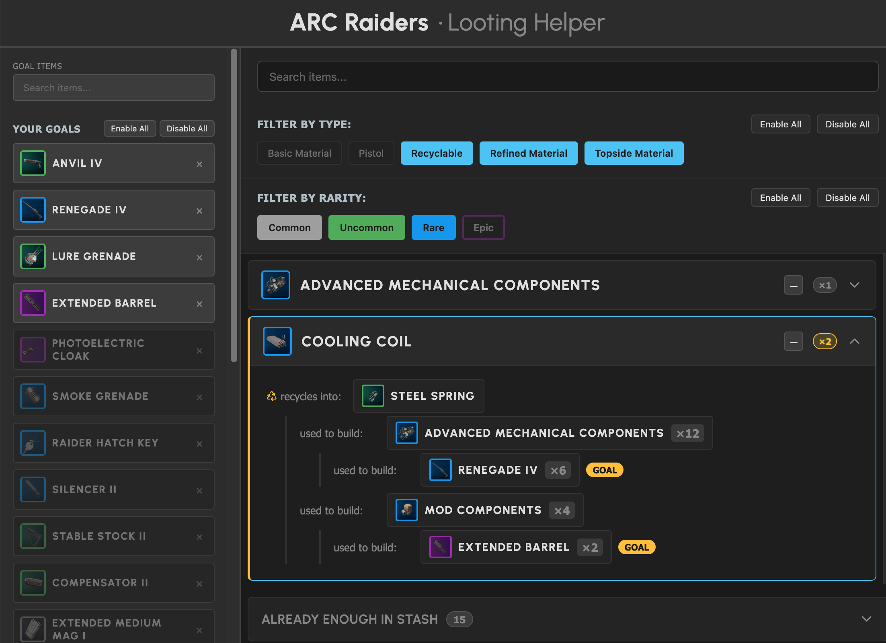

# What to Loot - ARC Raiders Crafting Visualizer



A web application to visualize crafting chains for ARC Raiders items, helping you quickly see what base materials you need to loot during raids.

## Features

- **Search & Add Goal Items**: Autocomplete search to find and add items you want to craft
- **Crafting Tree Visualization**: Left-to-right React Flow graphs showing complete crafting chains
- **Salvaging Support**: Displays items that can be salvaged to obtain required materials
- **Separate & Combined Views**: Toggle between individual trees or a combined view showing total materials
- **Rarity-Colored Icons**: Items displayed with color-coded borders (Common, Uncommon, Rare, Epic, Legendary)
- **LocalStorage Persistence**: Your goal items list is saved in the browser
- **Dark Theme**: Consistent with the ARC Raiders aesthetic

## How to Use

1. **Set Your Crafting Goals**: Use the search bar to find and add items you want to regularly craft. This builds your master list of requirements.
2. **Identify Loot Priorities**: The app automatically generates a list of all base resources and materials you need to loot to achieve these crafting goals.
3. **Manage Your Stash**: You can mark items as "I have enough in my stash" (e.g., if you already have plenty of batteries or wires). This dynamically reduces the "what to loot / keep" list, showing only what you still actually need.
4. **Optimize Your Raids**: Use this list during or after a raid to quickly understand what items to keep or salvage, versus what to leave behind or sell.

### Example Workflow
If you are aiming to craft a specific gadget, add it as a goal. The visualizer will show you the entire tree—from the final item down to the basic materials like "Circuit Boards" or "Chemicals". If you find a "Topside Item" during a raid, you can quickly check which materials it salvages into, helping you decide if it's worth the inventory space.

> **Note**: This tool specifically focuses on items needed for **crafting**. Remember to combine these requirements with what you might need for expeditions or projects.

### Learning the Game
A key benefit of this tool is learning the relationship between "topside items" and the materials they provide. As you use the app, you'll develop a "feel" for what's valuable. The ultimate goal is that you won't need this tool anymore after plenty of hours, because you'll have learned exactly what to keep!


## Tech Stack

- **React 19** with TypeScript
- **Vite 7** for build tooling
- **React Flow 11** for graph visualization
- **Dagre** for automatic graph layout
- **SCSS** for styling
- **Data Source**: [arcraiders-data](https://github.com/RaidTheory/arcraiders-data)

## Setup

### Prerequisites

- Node.js (v20 or higher recommended)
- npm

### Installation

```bash
# Install dependencies
npm install

# Generate item data from arcraiders-data
npm run generate-data

# Start development server
npm run dev

# Build for production
npm run build
```

## Project Structure

```
src/
├── components/       # React components
│   ├── Header.tsx
│   ├── Footer.tsx
│   ├── Sidebar.tsx
│   └── ItemNode.tsx
├── styles/          # SCSS stylesheets
│   ├── _variables.scss
│   ├── _base.scss
│   ├── _sidebar.scss
│   ├── _item-node.scss
│   └── main.scss
├── types/           # TypeScript type definitions
│   └── item.ts
├── utils/           # Utility functions
│   ├── dataLoader.ts       # Load items from JSON
│   ├── storage.ts          # LocalStorage helpers
│   ├── craftingChain.ts    # Crafting tree logic
│   └── graphBuilder.ts     # React Flow graph generation
└── App.tsx          # Main application component
```

## Data Generation

The `generate-item-data.sh` script copies item JSON files from `../arcraiders-data/items/` and creates an index for efficient loading. Run this script whenever the upstream data is updated:

```bash
npm run generate-data
```

## Credits

- Data provided by [RaidTheory/arcraiders-data](https://github.com/RaidTheory/arcraiders-data) and [arctracker.io](https://arctracker.io)
- Inspired by the quest-tracker application design

## License

ISC
